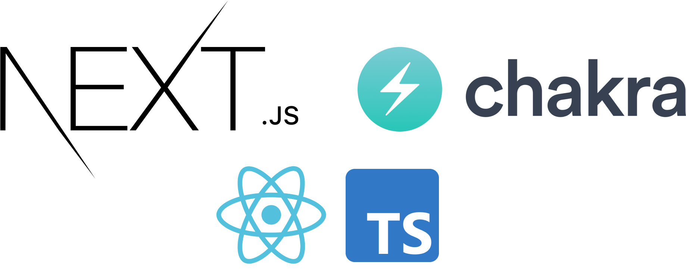
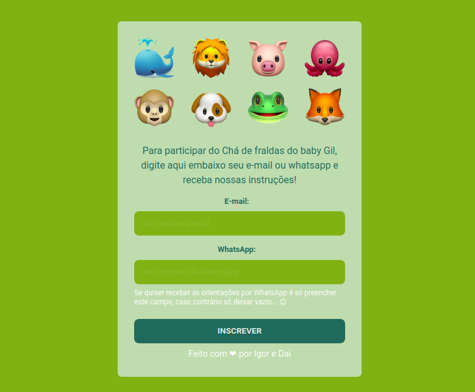

<br>
<div align="center">
  

  <h4 align="center">
    Newsletter Chá de Bebê do Gil
  </h4>
</div>

---


<p align="center">
  
</p>
<p>A simple page created with a form and mailchimp API integration, to organize the presents from my friends to my incoming baby in this pademic scenario.</p>


## 🚀 Getting started

To clone and run the application, you will need to have [Git](https://git-scm.com), [Node.js](https://nodejs.org) + [Yarn](https://yarnpkg.com) installed on your machine. With all programs installed, run the following command lines:


```bash
# Clone this repository
$ git clone https://github.com/Igorbrands/newsletter-baby-gil.git

# Access the repository
$ cd youtube-nextjs-design-system

# Install the dependencies
$ yarn install

# Run application
$ yarn dev
```


